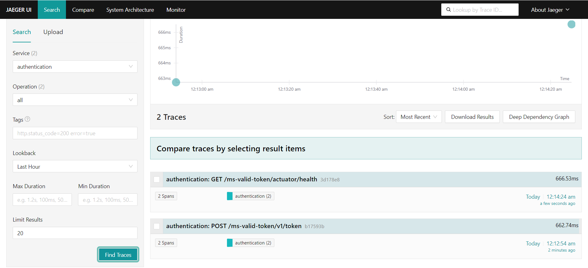
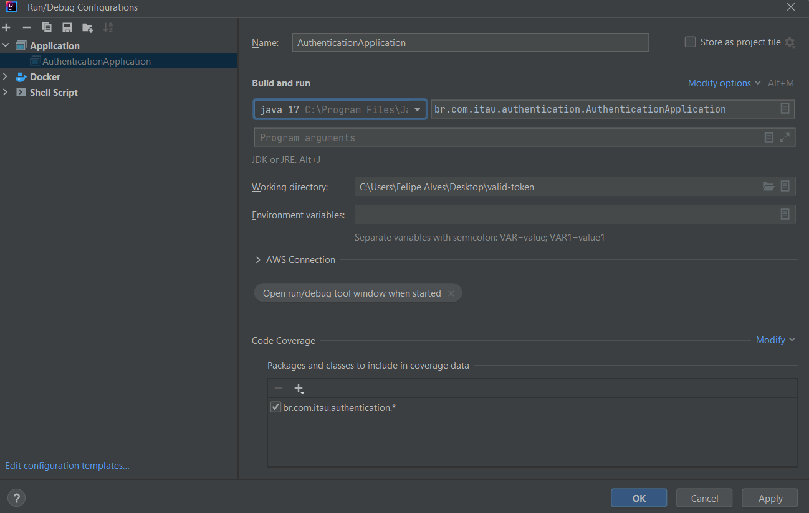

# Valid-Token

### Objetivo

Esta aplicação tem a responsabilidade de validar tokens de entrada e responder se são verdadeiros ou falsos.

## Configurações da aplicação

### Pré-requisitos

| Componente        | Versão | Descrição                       |
|-------------------|--------|---------------------------------|
| Java              | 17     | Plataforma Java                 |
| Apache Maven      | 3+     | Construção e gestão de dependências |
| Docker Desktop    | -      | Plataforma de virtualização de contêineres |

### Links úteis para download dos componentes

Java 17 - [Download JDK 17](https://download.oracle.com/java/17/archive/jdk-17.0.10_windows-x64_bin.exe)  
Maven 3.8.8 - [Download Maven 3.8.8](https://maven.apache.org/download.cgi)  
Docker Desktop - [Download Docker Desktop](https://www.docker.com/products/docker-desktop/)

## Execução do projeto

Após a instalação de todos os componentes obrigatórios para a execução do projeto, basta ir até a raiz do projeto e executar o seguinte comando no git bash: `"C:/SEU_DIRETORIO_AQUI/valid-token/bash.sh"`. Após a execução do script `bash.sh`, o contêiner será criado dentro do Docker com a aplicação e o Jaeger para observabilidade da aplicação.

- Aplicação: [http://localhost:8080/ms-valid-token](http://localhost:8080/ms-valid-token)
- Jaeger: [http://localhost:16686/search](http://localhost:16686/search)

Após as primeiras execuções, o OTEL começará a ingesta dentro do Jaeger.

### Outras formas de execução

Caso não queira executar um contêiner Docker na sua máquina, você pode executar o projeto de

## Consumir a aplicação

Encontra-se disponível na raiz do projeto uma pasta com a collection necessária para a chamada dos endpoints.

## Evidencias Projeto

[Clique aqui para abrir evidencias](Evidencias%20Funcionalidade.pdf)